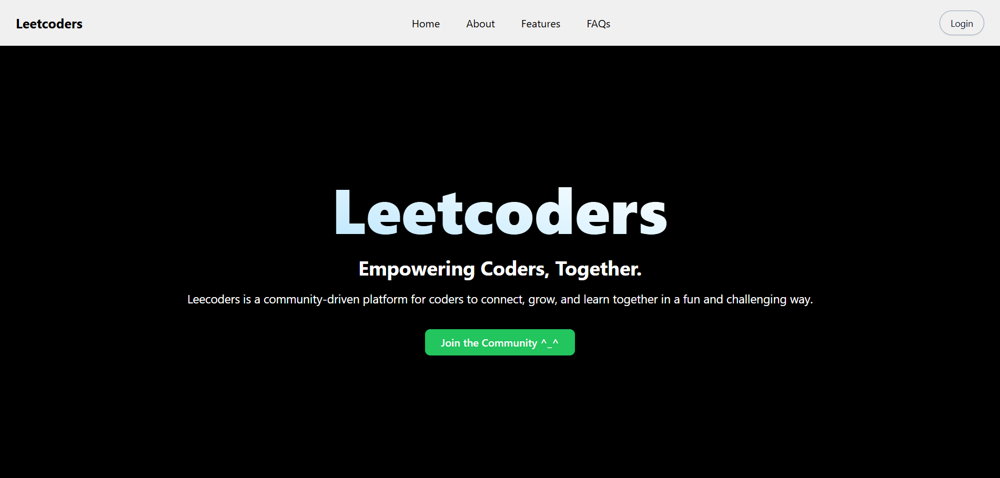

# Leetcoders

### 🔗Live - https://www.leetcoders.xyz/

> **🚨 Looking for Maintainers!**  
> We are actively seeking maintainers to help grow and improve LeetCoders. If you're passionate about coding community, development, and open source, we'd love to have you on board! Please reach out through our [Discussions](https://github.com/lokeshch185/leetcoders/discussions) or connect with me on [Linkedin](https://www.linkedin.com/in/lokeshch18/).



Leetcoders is a community-driven platform based around leetcode. Whether someone is starting his leetcode journey or looking to polish his profile, Leetcoders provides the tools and supportive community to boost it up.

## Core Features

### DCC Tracker
It tracks the daily coding challenge questions of all it's users and reminds them if they miss it for the day.

### Self Goals
Allows users to set personalized coding goals for LeetCode and automatically tracks their progress over time.

### Friendly Challenges
It provides users to enter into friendly challenges like solving more questions or staying active, completely based on their leetcode performace and keeps them updated about it till the challenge ends.

### Leaderboard
It provides users with a global leaderboard with custom ranking algorithm that considers their overall leetcode stats and not just contest ranking to make it more fun.

### Sheet Tracking
It tracks and shows the progress of the questions solved on leetcode for the user from a given leetcode sheet, the most famous being striver's sheet. 

## 🏗️ Project Structure

```
leetcoders/
├── frontend/           # React frontend application
├── backend/           # Node.js backend server
└── chat-app-backend/  # Real-time chat backend
```

## 🚀 Tech Stack

### Frontend
- React.js
- Socket.IO Client

### Main Backend
- Node.js
- Express.js
- MongoDB
- Socket.IO

### Chat Backend
- Node.js
- Express.js
- Socket.IO

### Database
- MongoDB

## 📋 Prerequisites

- Node.js (v14 or higher)
- MongoDB
- npm or yarn
- Git

## 🔧 Installation

1. Clone the repository:
```bash
git clone https://github.com/lokeshch185/leetcoders.git
cd leetcoders
```

2. Install dependencies for all services:
```bash
# Install root dependencies
npm install

# Install frontend dependencies
cd frontend
npm install

# Install backend dependencies
cd ../backend
npm install

# Install chat backend dependencies
cd ../chat-app-backend
npm install
```

3. Set up environment variables:
   - Create `.env` files in both backend and chat-app-backend directories
   - Follow the environment setup instructions in each service's README

4. Start the development servers:
```bash
# Start frontend (from frontend directory)
npm run dev

# Start backend (from backend directory)
node index.js

# Start chat backend (from chat-app-backend directory)
node index.js
```

## 📚 Documentation

- [Frontend Documentation](./frontend/README.md)
- [Backend Documentation](./backend/README.md)
- [Chat Backend Documentation](./chat-app-backend/README.md)
- [Contributing Guidelines](./CONTRIBUTING.md)

## 🤝 Contributing

We welcome contributions! Please see our [Contributing Guidelines](./CONTRIBUTING.md) for details.

## 📝 License

This project is licensed under the MIT License - see the [LICENSE](./LICENSE) file for details.

## 👥 Authors

- Lokesh Chaudhari - Initial work - [GitHub](https://github.com/lokeshch185)

## 🙏 Acknowledgments

- LeetCode for inspiration
- All contributors who have helped shape this project
- The open-source community

## 📞 Support

For support, please:
1. Open an issue in the GitHub repository
2. Contact the maintainers

## 🔄 Roadmap

- [ ] Improve code quality
- [ ] Improve documentation
- [ ] Fix chat application
- [ ] Create personalized recommendation system for solving questions
- [ ] Add more challenge types
- [ ] Implement code execution sandbox

## 📊 Project Status

This project is currently in active development.